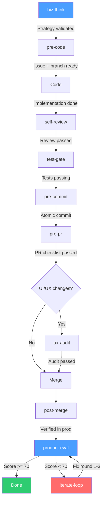

# PowerSkill

**Quality-enforced development workflows for Claude Code**

[](LICENSE)

PowerSkill turns Claude Code from a code generator into a disciplined engineering partner. It makes the AI check its own work through automated SOP skills, safety hooks, and a critical thinking protocol that forces adversarial reasoning before conclusions.

---

## The Problem

AI coding agents don't check their own output. They claim work is done without testing, rationalize away quality issues ("pre-existing", "out of scope", "follow-up task"), and produce inconsistent results across sessions.

PowerSkill solves this with **enforced quality gates at every workflow stage** -- a layered skill and hook system where each layer reinforces the others.

---

## Philosophy

- **Adversarial reasoning**: AI should argue both sides before concluding. The thinking protocol requires searching the web, finding contradictions, and synthesizing -- not just pattern-matching from training data.
- **Quality through process, not filtering**: Enforcement happens through skill SOPs at each workflow stage, not post-hoc output filtering. Every action has a checklist; every checklist has verification steps.
- **Critical thinking is structural**: Epistemic discipline, verification over assumption, and quality intolerance are built into the CLAUDE.md principles that sit in context permanently -- not bolted on as afterthoughts.

---

## How It Works

PowerSkill is a 3-layer architecture where each layer reinforces the others:

```
Layer 1: CLAUDE.md  (117 lines)  -- Principles always in context
Layer 2: Skills     (13 SOPs)    -- Auto-triggered at workflow stages, loaded on-demand
Layer 3: Hooks      (2 hooks)    -- Deterministic enforcement, runs outside the LLM
```

- **Layer 1** sets the ground rules: epistemic discipline, verification over assumption, quality intolerance.
- **Layer 2** provides step-by-step SOPs that Claude invokes before each action (coding, committing, reviewing, etc.).
- **Layer 3** runs outside the model entirely -- shell scripts that block dangerous operations and flag common mistakes in edited files.

---

## The Workflow



Every stage has a skill. Every skill has a checklist. Skipping a stage means skipping its checks -- and the principles in CLAUDE.md push back against that.

---

## Quick Install

```bash
git clone https://github.com/Docat0209/PowerSkill.git
cd PowerSkill && ./install.sh
```

The installer copies skills, hooks, and the CLAUDE.md template into your `~/.claude/` directory.

To install into an existing project manually:

```bash
# Copy the CLAUDE.md template
cp claude.md ~/.claude/CLAUDE.md

# Copy hooks
cp hooks/safety-guard.sh ~/.claude/hooks/
cp hooks/post-edit-review.sh ~/.claude/hooks/

# Copy skills
cp -r skills/* ~/.claude/skills/

# Copy hook configuration
cp settings/hooks.json ~/.claude/settings.json
```

---

## What's Included

### Skills (13 SOPs)

| Skill | Stage | What It Enforces | Sources |
|---|---|---|---|
| `biz-think` | Before building | Porter, JTBD, Lean Canvas, AARRR, Sean Ellis PMF | Business strategy frameworks |
| `pre-code` | Before coding | Issue exists, branch from dev, requirements clear, SOLID design | SOLID, NASA Power of 10 |
| `self-review` | After coding | 6-step review: diff, correctness, design, hygiene, security, verdict | Google Engineering Practices, Clean Code, OWASP |
| `test-gate` | Before PR | 3-layer testing: unit + integration + E2E, AAA pattern, isolation | Fowler Testing Pyramid, Google Testing Blog |
| `pre-commit` | Before commit | Atomic commits, conventional format, 10-point checklist | Chris Beams, NASA Rule 10 |
| `pre-pr` | Before PR creation | PR size <200 lines, 9-point checklist, self-review diff | Google Small CLs |
| `ux-audit` | Before merge | Visual review, discoverability, functional UX, performance (Core Web Vitals) | Playwright MCP |
| `post-merge` | After merge | 4-step verification: works, check boxes, close issue, delete branch | -- |
| `product-eval` | After feature | 4-dimension scoring (/100): Nielsen, Cognitive Walkthrough, FTUE, HEART | Nielsen Heuristics, Google HEART |
| `iterate-loop` | Score < 70 | Auto-fix loop: evaluate, prioritize, fix, re-evaluate (max 3 rounds) | -- |
| `issue-create` | Creating issues | Templates by type (feat/fix/chore), priority labels | -- |
| `project-init` | New project | Git + CI/CD + test runner + E2E + branch protection | -- |
| `search-eval` | Evaluating sources | Source credibility, multi-source consistency, GitHub project evaluation | -- |

### Hooks (2 guards)

| Hook | Event | What It Does |
|---|---|---|
| `safety-guard.sh` | PreToolUse (Bash) | Blocks: `--force` push, `reset --hard`, `checkout .`, `clean -f`, `branch -D`, `--no-verify`, credential dir access |
| `post-edit-review.sh` | PostToolUse (Write/Edit) | Detects: debug statements, TODO/FIXME comments, hardcoded secrets, Bearer tokens, `.env` modifications |

---

## Recommended Agents

PowerSkill's agent prompts are built on top of [Agency Agents](https://github.com/msitarzewski/agency-agents) -- a collection of 100+ specialized agent definitions for Claude Code. Install them to get the full roster of sub-agents (Backend Architect, Frontend Developer, UX Researcher, Growth Hacker, etc.) that the orchestrator delegates to.

```bash
git clone https://github.com/msitarzewski/agency-agents.git
cp -r agency-agents/agents/* ~/.claude/agents/
```

---

## Recommended MCP Servers

These optional MCP servers enhance specific skills:

| Server | Purpose | Used By | Install |
|---|---|---|---|
| [Knowledge Graph Memory](https://github.com/modelcontextprotocol/servers/tree/main/src/memory) | Cross-conversation learning | All skills | `claude mcp add knowledge-graph -- npx -y @anthropic-ai/mcp-knowledge-graph` |
| [Sequential Thinking](https://github.com/modelcontextprotocol/servers/tree/main/src/sequentialthinking) | Structured multi-step reasoning | `biz-think`, `product-eval` | `claude mcp add sequential-thinking -- npx -y @anthropic-ai/mcp-sequential-thinking` |
| [Playwright](https://github.com/anthropics/mcp-playwright) | Browser automation for visual review | `ux-audit` | `claude mcp add playwright -- npx @playwright/mcp@latest` |

---

## Customization

### Add a new skill

1. Create a directory under `skills/` with your skill name:
   ```bash
   mkdir skills/my-skill
   ```
2. Add a `SKILL.md` file with the SOP checklist. Follow the pattern of existing skills.
3. Register the trigger in `claude.md` under the **Skill Gate Protocol** section:
   ```
   - Before [action] → invoke `my-skill`
   ```

### Modify CLAUDE.md

Edit `claude.md` directly. The 117-line template is intentionally concise -- every line earns its place in the context window. Add principles sparingly.

### Add a new hook

1. Write a shell script in `hooks/`. Use exit code `2` to block (PreToolUse) or `0` to allow.
2. Register it in `settings/hooks.json` under the appropriate event (`PreToolUse` or `PostToolUse`).

---

## Uninstall

```bash
./uninstall.sh
```

This removes all PowerSkill files from `~/.claude/` and restores your previous configuration if a backup exists.

---

## Credits

PowerSkill synthesizes practices from established engineering and product frameworks:

- **[Google Engineering Practices](https://google.github.io/eng-practices/)** -- code review standards, small CLs
- **[Clean Code](https://www.oreilly.com/library/view/clean-code/9780136083238/)** (Robert C. Martin) -- self-review principles
- **[SOLID Principles](https://en.wikipedia.org/wiki/SOLID)** -- design constraints in pre-code
- **[NASA Power of 10](https://en.wikipedia.org/wiki/The_Power_of_10:_Rules_for_Developing_Safety-Critical_Code)** -- pre-commit verification rules
- **[OWASP Top 10](https://owasp.org/www-project-top-ten/)** -- security checks in self-review
- **[Chris Beams on Git Commits](https://cbea.ms/git-commit/)** -- commit message format
- **[Conventional Commits](https://www.conventionalcommits.org/)** -- commit type enforcement
- **[Martin Fowler Testing Pyramid](https://martinfowler.com/articles/practical-test-pyramid.html)** -- 3-layer test strategy
- **[Nielsen Usability Heuristics](https://www.nngroup.com/articles/ten-usability-heuristics/)** -- product evaluation dimensions
- **[Google HEART Framework](https://research.google/pubs/pub36299/)** -- metrics in product-eval
- **[Cognitive Walkthrough](https://en.wikipedia.org/wiki/Cognitive_walkthrough)** -- FTUE evaluation method
- **[Porter's Value Chain](https://en.wikipedia.org/wiki/Value_chain)** -- business analysis in biz-think
- **[Jobs to Be Done](https://hbr.org/2016/09/know-your-customers-jobs-to-be-done)** (Clayton Christensen) -- customer lens
- **[Lean Canvas](https://leanstack.com/lean-canvas)** (Ash Maurya) -- business model validation
- **[AARRR Pirate Metrics](https://www.slideshare.net/daboross/startup-metrics-for-pirates)** -- growth funnel analysis
- **[Sean Ellis PMF Survey](https://www.startup-marketing.com/the-startup-pyramid/)** -- product-market fit signal

---

## License

[MIT](LICENSE) -- Copyright (c) 2026 Shane Ho
